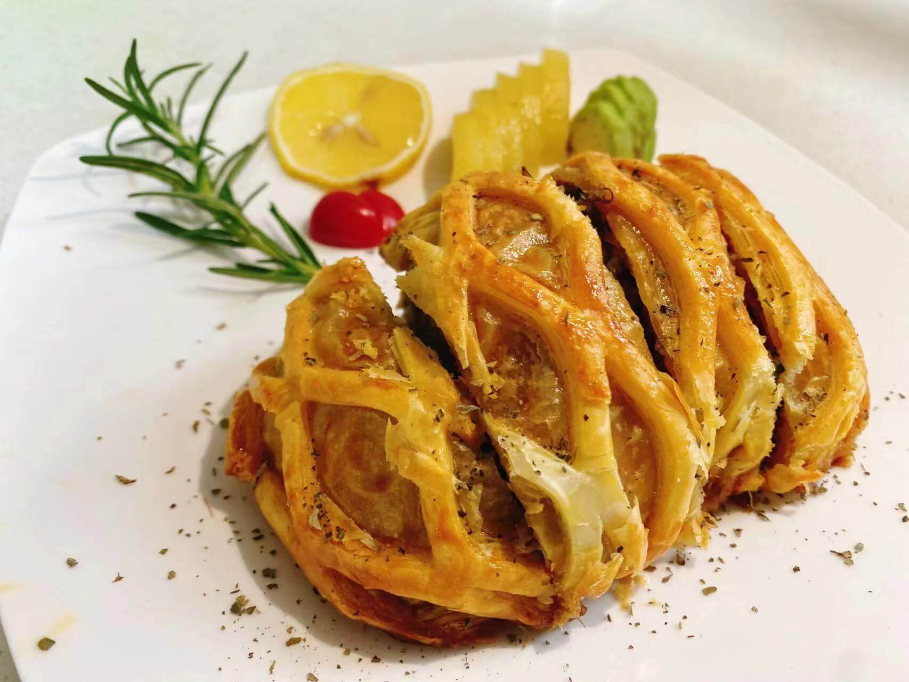

[Simplified Chinese README | 简体中文说明](README_cn.md)

### My Masterpieces

  

> This is a Beef Wellington I learned to make in 2022. My small dream is to open a Wuxi snack shop, selling bubble wontons, small steamed buns, magnolia cakes, hot and sour soup, and Suzhou-style noodles.

- 🐋\[[orcas](https://github.com/orcastor)\] 🗄️Lightweight NAS solution that is smarter and more modern. **(WIP)**
  - 💸 Low cost: 3D print hot-swappable backplane reduce costs to 25%, ultra-high-performance system only costs ¥745.6 (without disk), 3\~18TB PMR storage only costs ¥1225.6\~3115.6
  - 🚧 Cross-platform: Supports Win, Linux, MacOSX and (RPi / ARM64) with only 30W for 6 disks
  - 📚 Replaceable storage engine: Default sqlcipher + self-developed storage
  - 📤 Supports multiple access protocols: http1.1/http2.0/http3.0/nfs/smb
- ❄️\[[idgen](https://github.com/orca-zhang/idgen)\] A snowflake algorithm ID generator
  - 🚀 Supports redis-based or local memory (fallback on failure)
  - ⌚ NTP synchronization and secure clock rollback (default 1 minute)
  - 🦖 JS precision security (not exceeding 53 bits)
- 🦄\[[ecache](https://github.com/orca-zhang/ecache)\] Lightweight local memory cache
  - 🤏 Less than 300 LOC, ready to be integrated in 30s
  - 🚀 High performance, minimalist design, concurrency safe
  - 🌈 Supports `LRU` and `LRU-2` modes
  - 🦖 Additional components support distributed consistency
- 🏎️\[[borm](https://github.com/orca-zhang/borm)\] A better ORM library
  - Similar to writing SQL, almost **no learning overhead**. The C++ version (not yet open-sourced) can handle data load/store from db to pb/struct in one line . The Go version uses reflect2 to solve **type conversion pain points**, with performance **close to or slightly better than native**, and has been used in production environments of two listed companies **without bugs** for many years.
- 🗂️\[LRUCache（[go](https://github.com/orca-zhang/lrucache) / [c++](https://github.com/ez8-co/linked_hash) / [js](https://github.com/orca-zhang/cache.js))\]
  - Implementations in three languages, all **beats 100%** in leetcode. The C++ version **cleverly avoid copying** by overloading the `key`, with **powerful** performance.
- 🐞\[[emock](https://github.com/ez8-co/emock)\] **Next-generation mock library**
  - Comparable to Google's googlemock, cross-platform support for mocking all functions (all **6 kinds of functions**), with one macro handling everything. **Unique solution of windows pdb file overload** symbol matching algorithm, **reflection-like, API Hook** principle implementation, and the only one **trampoline safe** on the Internet.
- 🚀\[[xpjson](https://github.com/ez8-co/xpjson)\] Mini cross-platform json library
  - Born in 2013, implemented with **C++11 & template metaprogramming (TMP, type extraction)** techniques, **only 1500 lines**, **no external dependencies**, support **SSO (Small String Optimization)/COW (Copy On Write)**
- 💜\[[influxdb](https://github.com/orca-zhang/influxdb-cpp)\] The **most popular** C and C++ client on GitHub
  - **Less than 300 LOC to decode** HTTP requests, with **no dependencies**, cleverly using **Duff's device** to merge processing ordinary and chunked returns
- 💉\[[yapi](https://github.com/ez8-co/yapi)\] **yet another process injector**
  - Eliminate the difference between **x86/x64/wow64** under Windows, injects the target process just **like writing a local program**, and no longer requires dll support
- 🔓\[[unlocker](https://github.com/ez8-co/unlocker)\] Ring3 layer (user mode, non-driver) file unlocking library
  - Possibly the **unique non-violent** solution in the world to unlock malformed directory deletion (this solution cannot be found on the Internet), the **unique memory-mapped file unlocking method** (the association between handle and mapfile has a fault line), supports cross-x86/x64/wow64 operations, supports skipping pipelines and other special handles that may cause deadlock
- 🔍\[[ezpp](https://github.com/ez8-co/ezpp)\] A very easy-to-use C++ **code-level performance profiler** with **online profiling**
  - The only one to support **recursion and multithreading** (compared to Google gprofiler and Intel VTune), widely used internally by the company, and has **resulted in performance optimization contributions many times**
- 🔲\[[jsqrcode](https://github.com/ez8-co/jsqrcode)\] Pure JS version QR code parsing library (zxing port)
  - **Several bugs fixed**, added support for **Japanese code table/Chinese character decoding** (loaded on demand), **greatly improved** decoding success rate
- 🆙\[[AutoUpdate](https://github.com/MFCer/AutoUpdate)\] Automatic update module implemented based on MFC
  - **Minimalist design** (only bubble interaction), **multilingual support**, **self-update**, **multiple update strategies**, **multi-node deployment**, **full-screen detection**, and provided SDK **plug-and-play**

